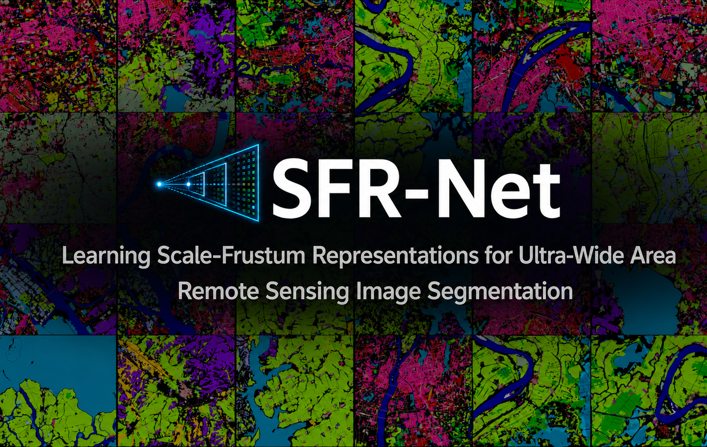
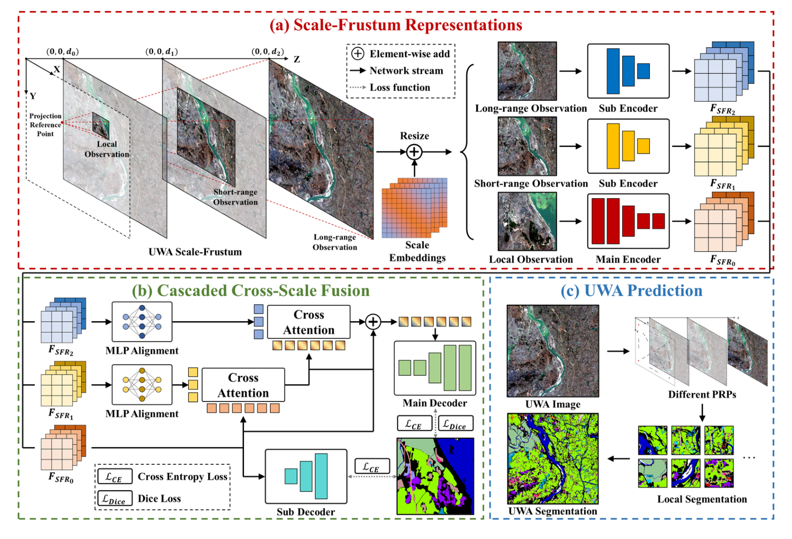
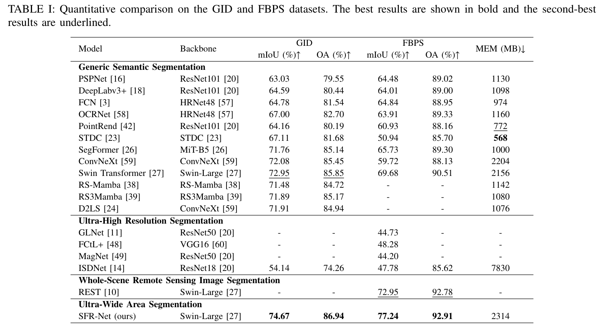

# SFR-Net

<p align="center">
  <a href="https://arxiv.org/abs/2605.25737"></a>
  <a href="https://huggingface.co/shadowwalk/SFR-Net"></a>
</p>

<p align="center">
  <a href="README.md">English</a> | 简体中文
</p>

<p align="center">
  
</p>

<p align="center">
  <strong>Learning Scale-Frustum Representations for Ultra-Wide Area Remote Sensing Image Segmentation</strong>
</p>

<p align="center">
  <a href="https://arxiv.org/abs/2605.25737">Paper</a> |
  <a href="https://huggingface.co/shadowwalk/SFR-Net">Weights</a>
</p>

## 概述 🧭

SFR-Net 面向 ultra-wide area (UWA) remote sensing images 的 semantic segmentation，此类图像同时具有极大的像素数量和地理覆盖范围。SFR-Net 围绕同一个 Projection Reference Point (PRP) 构建相互对齐的 local、short-range 和 long-range observations，将其缩放至统一输入尺寸，并通过可学习的 scale embeddings 区分不同尺度。随后，Cascaded Cross-Scale Fusion (CCSF) module 逐步向 local representation 注入上下文信息，在保留精细细节的同时增强 long-range semantic continuity。

<p align="center">
  
</p>

## 新闻 📰

- **2026-08-26：** 我们更新了代码版本，修复了一些已知 bug，更新了推理、测试和可视化脚本，并公开了在 GID、FBPS 和 Inria Aerial 上训练好的权重。
- **2026-07-11：** 我们收到了来自 IEEE Transactions on Geoscience and Remote Sensing (IEEE TGRS) 的第一轮审稿意见，稿件进入大修阶段。
- **2026-05-25：** 我们的论文 [“SFR-Net: Learning Scale-Frustum Representations for Ultra-Wide Area Remote Sensing Image Segmentation”](https://arxiv.org/abs/2605.25737) 已在 arXiv 上公开。
- **2026-05-20：** 我们的论文 “SFR-Net: Learning Scale-Frustum Representations for Ultra-Wide Area Remote Sensing Image Segmentation” 已投稿至 IEEE TGRS。
- **2026-05-11：** 我们发布了初步代码版本，提供了训练和测试代码以及预训练权重。

## 亮点 ✨

- 我们提出 ultra-wide area remote sensing image segmentation 任务，同时考虑大像素数量、极广地理覆盖、显著的目标尺度变化以及 long-range semantic continuity。
- Scale-Frustum Representations 围绕同一个 PRP 统一表示 local、short-range 和 long-range observations。发布的 GID/FBPS configs 使用距离 `[1, 3, 14]`，Inria Aerial config 使用 `[1, 3, 10]`。
- 可学习的 scale embeddings 能够明确区分经过缩放的不同空间范围 observations。
- CCSF module 将邻近区域和更大范围的上下文信息逐步注入精细的 local features。
- SFR-Net 在 UWA GID 和 FBPS benchmarks 上取得了 state-of-the-art 结果。SFR representation 还可用于提升通用 segmentation networks 的精度和收敛速度。

## 性能 📊

下表截取自论文。在论文实验设置下，SFR-Net 在 GID 上达到 `74.67%` mIoU，在 FBPS 上达到 `77.24%` mIoU。

<p align="center">
  
</p>

## 仓库结构 🗂️

```text
SFR-Net/
├── configs/
│   ├── _base_/
│   │   ├── datasets/
│   │   ├── schedules/
│   │   └── default_runtime.py
│   ├── gid/sfrnet_swinl_320k_gid.py
│   ├── fbps/sfrnet_swinl_320k_fbps.py
│   └── inria_aerial/sfrnet_swinl_320k_inria_aerial.py
├── mmseg/
│   ├── datasets/transforms/sfr_loading.py
│   ├── datasets/uwa_dataset.py
│   ├── models/backbones/sfr_net.py
│   └── models/necks/ccsf_neck.py
├── tools/
│   ├── train.py
│   ├── test.py
│   ├── sfr_inference.py
│   ├── get_res_iou.py
│   └── visualizer.py
├── pics/
├── pretrain/
├── weights/
├── README.md
└── README_zh-CN.md
```

当前发布版本保留默认 SFR-Net 核心通路以及 GID、FBPS 和 Inria Aerial configs。多距离消融实验和其他仅用于实验的 modules 未包含在该版本中。

## 权重 🔑

所有预训练 backbones 和已发布的 SFR-Net checkpoints 均托管于 [SFR-Net Hugging Face 仓库](https://huggingface.co/shadowwalk/SFR-Net)。

### 可用文件

| 类型 | 文件 | 预期位置 |
| --- | --- | --- |
| ResNet-18 ImageNet 预训练权重 | [`resnet18_v1c-b5776b93.pth`](https://huggingface.co/shadowwalk/SFR-Net/blob/main/pretrain/resnet18_v1c-b5776b93.pth) | `pretrain/resnet18_v1c-b5776b93.pth` |
| Swin-Large ImageNet-22K 预训练权重 | [`swin_large_patch4_window12_384_22k_20220412-6580f57d.pth`](https://huggingface.co/shadowwalk/SFR-Net/blob/main/pretrain/swin_large_patch4_window12_384_22k_20220412-6580f57d.pth) | `pretrain/swin_large_patch4_window12_384_22k_20220412-6580f57d.pth` |
| GID checkpoint | [`iter_320000_gid.pth`](https://huggingface.co/shadowwalk/SFR-Net/blob/main/weights/iter_320000_gid.pth) | `weights/iter_320000_gid.pth` |
| FBPS checkpoint | [`iter_320000_fbps.pth`](https://huggingface.co/shadowwalk/SFR-Net/blob/main/weights/iter_320000_fbps.pth) | `weights/iter_320000_fbps.pth` |
| Inria Aerial checkpoint | [`iter_320000_inria.pth`](https://huggingface.co/shadowwalk/SFR-Net/blob/main/weights/iter_320000_inria.pth) | `weights/iter_320000_inria.pth` |

可以使用 Hugging Face CLI 下载这些文件：

```bash
pip install -U huggingface_hub
hf download shadowwalk/SFR-Net --local-dir downloads/SFR-Net
cp -r downloads/SFR-Net/pretrain/. pretrain/
cp -r downloads/SFR-Net/weights/. weights/
```

### 已发布 checkpoint 结果

| Dataset | OA (%) | mIoU (%) | mF1 (%) | Checkpoint |
| --- | ---: | ---: | ---: | --- |
| GID | 86.82 | 74.46 | 85.73 | `weights/iter_320000_gid.pth` |
| FBPS | 93.50 | 77.86 | 66.72 | `weights/iter_320000_fbps.pth` |
| Inria Aerial | 96.91 | 83.96* | 91.28* | `weights/iter_320000_inria.pth` |

`*` 对于 Inria Aerial，IoU 和 F1 仅统计 building 类别。发布的 checkpoints 使用随机种子 `42` 训练，因此结果与论文中报告的数值略有差异。

backbone 路径目前定义在 `mmseg/models/backbones/sfr_net.py` 中。如果两个预训练文件保存在 `pretrain/` 下，并从仓库根目录执行命令，则不需要修改代码。

## 安装 🛠️

请先根据 GPU 创建匹配的 PyTorch/CUDA 环境，然后在 SFR-Net 仓库根目录安装：

```bash
conda create -n sfrnet python=3.10 -y
conda activate sfrnet

# 请先参考 https://pytorch.org/get-started/locally/ 安装 PyTorch
pip install -U openmim
mim install mmengine "mmcv>=2.0.0"
pip install -r requirements.txt
pip install -v -e .
pip install mxnet
```

`tools/sfr_inference.py` 使用 `mxnet` 读取原始 ultra-wide images。

## 数据准备 🗃️

数据集官方网站：

| Dataset | Website |
| --- | --- |
| GID | [Gaofen Image Dataset](https://x-ytong.github.io/project/GID) |
| FBPS | [Five-Billion-Pixels](https://x-ytong.github.io/project/Five-Billion-Pixels.html) |
| Inria Aerial | [Inria Aerial Image Labeling Dataset](https://project.inria.fr/aerialimagelabeling/) |

请按照以下方式组织数据集：

```text
SFR-Net/
└── data/
    ├── GID/
    │   ├── Image_train/
    │   ├── Image_test/
    │   ├── annos_train_5l/
    │   ├── annos_test_5l/
    │   ├── annos_train_24l/
    │   └── annos_test_24l/
    └── inria_aerial/
        ├── images/
        │   ├── train/
        │   ├── val/
        │   └── test/
        └── Label/
            ├── train/
            ├── val/
            └── test/
```

GID 和 FBPS 使用相同的 GF-2 images，但使用不同的 label folders。GID 使用 5-category annotations，输出包含 background 在内的 6 个 class indices；FBPS 使用 24-category annotations，输出包含 background 在内的 25 个 class indices。Inria Aerial 使用两个 class indices：background 和 building。

发布的 configs 中仍保留原始本地绝对路径。训练或验证之前，请修改以下三个文件：

```python
# configs/_base_/datasets/gid.py
data_root = 'data/GID'

# configs/_base_/datasets/fbps.py
data_root = 'data/GID'

# configs/_base_/datasets/inria_aerial.py
data_root = 'data/inria_aerial'
```

也可以将数据集保存在其他位置，并把各 `data_root` 设置为相应的绝对路径。`data_root` 下的文件夹名称仍须与上述结构一致。

## 训练 🏋️

训练之前：

1. 按照“数据准备”部分的说明，在对应的 `configs/_base_/datasets/` 文件中设置 `data_root`。
2. 检查所选 experiment config 中的 `batch_size` 和 `num_workers`。发布的 configs 使用 batch size `4`，并将 `num_workers` 覆盖为 `64`；如果 GPU memory 或 CPU resources 不足，请适当减小。
3. 将两个 backbone checkpoints 保存在 `pretrain/` 下；如果使用其他位置，请修改 `mmseg/models/backbones/sfr_net.py` 中的 `depth2ckpt`。

使用随机种子 `42` 进行训练（`configs/_base_/default_runtime.py` 和 `tools/train.py` 中的默认值）：

```bash
python tools/train.py configs/gid/sfrnet_swinl_320k_gid.py \
  --work-dir work_dirs/gid

python tools/train.py configs/fbps/sfrnet_swinl_320k_fbps.py \
  --work-dir work_dirs/fbps

python tools/train.py configs/inria_aerial/sfrnet_swinl_320k_inria_aerial.py \
  --work-dir work_dirs/inria_aerial
```

添加 `--amp` 可启用 automatic mixed precision。使用相同的 `--work-dir` 并添加 `--resume` 可从最新 checkpoint 继续训练。

## 推理 🛰️

`tools/sfr_inference.py` 的 `DATASETS` dictionary 中包含原始机器上的默认路径，例如 `/mnt/dataset/zhongchuyu/...`。可以将其中的 `src` 修改为 `data/GID/Image_test` 和 `data/inria_aerial/images/test`，也可以像下面这样显式传入 `--src`。命令行参数会覆盖默认值。

```bash
python tools/sfr_inference.py \
  --dataset gid \
  --src data/GID/Image_test \
  --dst work_dirs/gid_predictions \
  --config configs/gid/sfrnet_swinl_320k_gid.py \
  --ckpt weights/iter_320000_gid.pth \
  --stride 128

python tools/sfr_inference.py \
  --dataset fbps \
  --src data/GID/Image_test \
  --dst work_dirs/fbps_predictions \
  --config configs/fbps/sfrnet_swinl_320k_fbps.py \
  --ckpt weights/iter_320000_fbps.pth \
  --stride 128

python tools/sfr_inference.py \
  --dataset inria_aerial \
  --src data/inria_aerial/images/test \
  --dst work_dirs/inria_aerial_predictions \
  --config configs/inria_aerial/sfrnet_swinl_320k_inria_aerial.py \
  --ckpt weights/iter_320000_inria.pth \
  --stride 128
```

默认的 `--load-type random` 会构建完整 scale-frustum representation。预测结果将保存为单通道 class-index PNG masks。

## 指标与可视化 🎨

### 指标

`tools/get_res_iou.py` 当前在 `DATASETS` dictionary 中保存了原始 ground-truth paths，并且没有提供 `--gt` 参数。评测前请修改该 dictionary：

```python
DATASETS = {
    'gid': ('data/GID/annos_test_5l', 6),
    'fbps': ('data/GID/annos_test_24l', 25),
    'inria_aerial': ('data/inria_aerial/Label/test', 2),
}
```

然后计算指标：

```bash
python tools/get_res_iou.py --dataset gid \
  --pred work_dirs/gid_predictions

python tools/get_res_iou.py --dataset fbps \
  --pred work_dirs/fbps_predictions

python tools/get_res_iou.py --dataset inria_aerial \
  --pred work_dirs/inria_aerial_predictions
```

### 可视化

`tools/visualizer.py` 不包含固定数据路径，请通过命令行传入输入和输出目录。其 `PALETTES` dictionary 包含 GID、FBPS 和 Inria Aerial colormaps；仅当 class-index convention 发生变化时才需要修改。

```bash
python tools/visualizer.py --dataset gid \
  --src work_dirs/gid_predictions \
  --dst work_dirs/gid_visualizations

python tools/visualizer.py --dataset fbps \
  --src work_dirs/fbps_predictions \
  --dst work_dirs/fbps_visualizations

python tools/visualizer.py --dataset inria_aerial \
  --src work_dirs/inria_aerial_predictions \
  --dst work_dirs/inria_aerial_visualizations
```

## 联系方式 ✉️

如果本工作对您有所帮助，请引用我们的[论文](https://arxiv.org/abs/2605.25737)：

```bibtex
@article{zhong2026sfr,
  title={SFR-Net: Learning Scale-Frustum Representations for Ultra-Wide Area Remote Sensing Image Segmentation},
  author={Zhong, Chuyu and Chen, Keyan and Yang, Qinzhe and Chen, Bowen and Zou, Zhengxia and Shi, Zhenwei},
  journal={arXiv preprint arXiv:2605.25737},
  year={2026}
}
```

如有问题或 bug report，欢迎联系 **buaazcy@buaa.edu.cn**。

如果本仓库对您有所帮助，欢迎给我们一个 star。最后是 Phoebe，请不要欺负她。

<p align="left">
  
</p>
